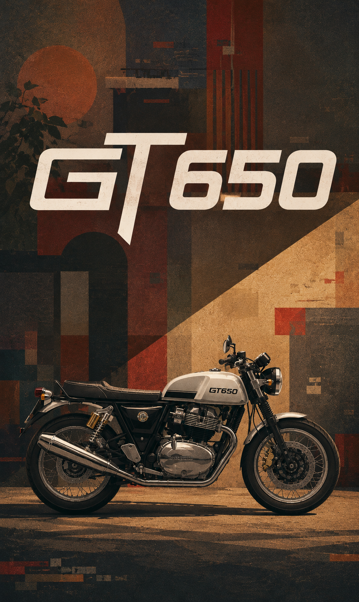

# GT650

<p align="center">
  A clean and minimal music player with a glass-style interface.
</p>

<p align="center">
  <a href="https://github.com/rageaman/GT650">
    
  </a>
  <a href="https://github.com/rageaman/GT650">
    
  </a>
  <a href="https://github.com/rageaman/GT650">
    
  </a>
</p>

<p align="center">
  <a href="YOUR_DEMO_LINK">🌐 Live Demo</a>
  &nbsp; • &nbsp;
  <a href="https://github.com/rageaman/GT650/issues">🐛 Report Issue</a>
  &nbsp; • &nbsp;
  <a href="https://github.com/rageaman/GT650">⭐ Repository</a>
</p>

---

## ✨ Preview

<p align="center">
  
</p>

---

## 🎵 About

A simple browser-based music player focused on a clean interface and smooth controls.

The player uses a floating glass-style control panel over a full-screen background, keeping the interface compact and distraction-free.

---

## ✨ Features

<table>
<tr>
<td width="50%">

### 🎧 Music Controls

- Play / Pause
- Previous track
- Next track
- Seek through the current track
- Mute / Unmute

</td>
<td width="50%">

### 🎨 Interface

- Glass-style player dock
- Background artwork
- Track thumbnail
- Track information
- Progress bar
- Playlist panel
- Active track indication

</td>
</tr>
</table>

---

## 🖥️ Interface

<table>
<tr>
<td align="center">
<b>Player</b><br><br>
Floating player controls with track information and playback controls.
</td>
<td align="center">
<b>Playlist</b><br><br>
A compact playlist panel for browsing available tracks.
</td>
</tr>
</table>

---

## 🛠️ Built With

<p align="center">
  
  
  
</p>

- **HTML** — Page structure
- **CSS** — Layout, responsive design and visual styling
- **JavaScript** — Player controls and playlist functionality

---

## 📁 Project Structure

```text
GT650/
│
├── background.jpg
├── index.html
├── script.js
├── style.css
└── README.md
